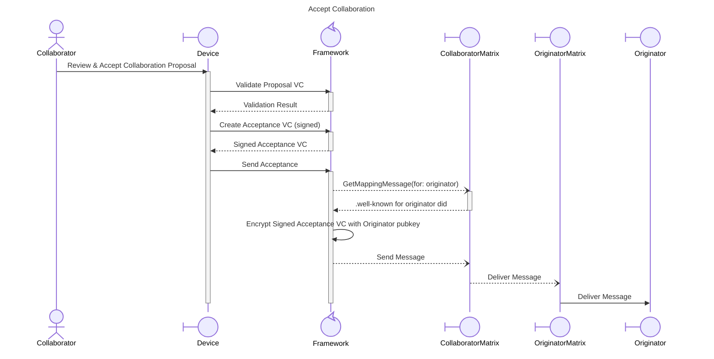

# Accept Collaboration Interaction Design

## Overview

## Actors

### Collaborator

The collaborator is the receiving Agent that was invited to participate in the Collaboration via the Propose flow. Upon receipt of a proposal, the Collaborator reviews the terms and decides to accept or reject.

### Device

Device is the hardware used by the Collaborator Agent to receive and process the Collaboration Proposal. Devices use the Framework to validate the proposal and create an acceptance response. Examples include web browsers, mobile applications, or AI Agent endpoints.

### Framework

The Framework is responsible for validating the integrity and authenticity of the received Collaboration Proposal VC, creating a signed Acceptance VC response, and securely routing it back to the Originator through the Matrix protocol.

### CollaboratorMatrix

CollaboratorMatrix is the Matrix homeserver or gateway instance associated with the Collaborator's Agent. It receives the acceptance message and routes it toward the Originator's Matrix instance.

### OriginatorMatrix

OriginatorMatrix is the Matrix homeserver or gateway instance associated with the Originator's Agent. It receives the acceptance message from the Collaborator's Matrix and delivers it to the Originator's Device.

### Originator

The Originator is the Agent who initially proposed the Collaboration. Upon receiving the acceptance from the Collaborator, they update their local collaboration state to reflect the accepted status.
