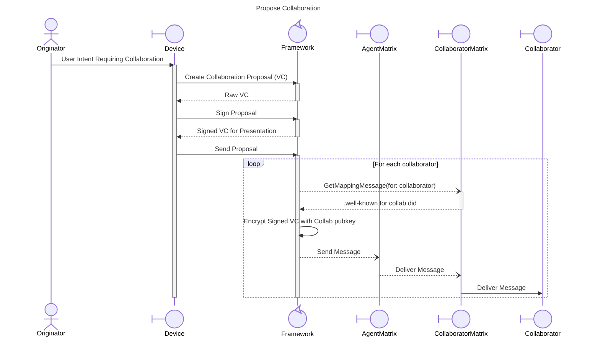

# Propose Collaboration Interaction Design

## Overview

## Actors

### Originator

The originator, or first, creator and sender of a Collaboration message.  As the originator, it is their role to collect all co-signed ProposedCollaboration messages and, when completed, send the final Collaboration VC to all participants.

### Device

Device is the hardware used by the Agent where a User Intent is performed that requires a Collaboration.  For example, a web browser on a laptop, a mobile application, AI Agent, etc.  Devices use the Framework to perform operations on the Collaboration.

### Framework

### AgentMatrix

### CollaboratorMatrix

### Collaborator

