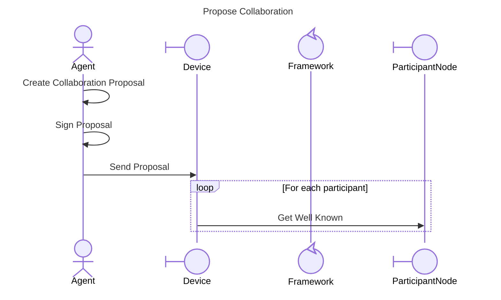

# Propose Collaboration Insteraction Design

## Overview

```mermaid

---
title: Propose Collaboration
---

sequenceDiagram
    actor Agent
    participant Device@{ "type" : "boundary" }
    participant Framework@{ "type" : "control" }
    participant ParticipantNode@{ "type" : "boundary" }

    Agent ->> Agent: Create Collaboration Proposal
    Agent ->> Agent: Sign Proposal
    Agent ->> Device: Send Proposal

    loop For each participant
        Device ->> ParticipantNode: Get Well Known 
        
    end


```
